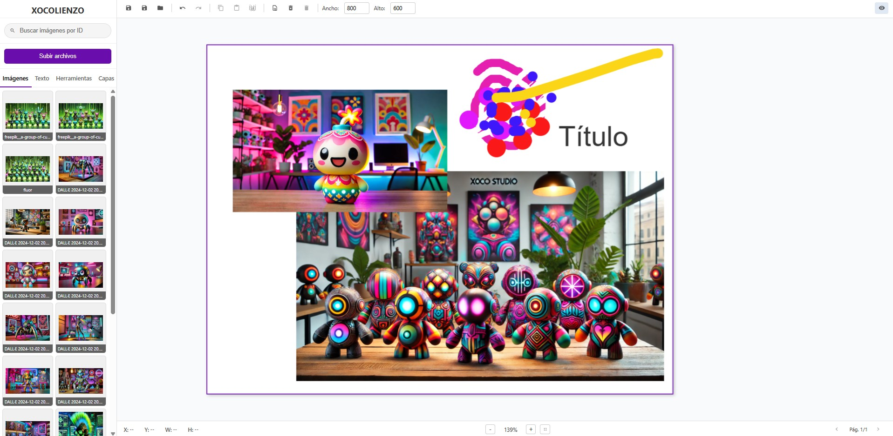

# Guía de Uso de XOCOLIENZO – Editor Canvas con Konva.js

## Acceso Rápido a la Aplicación
[XOCOLIENZO - Demo en vivo](https://xococode.github.io/xocofolionow/)

XOCOLIENZO es un editor de páginas “canvas” basado en [Konva.js], que permite dibujar formas básicas, pintar a mano alzada, manejar imágenes y texto prediseñado, gestionar capas, copiar/pegar/duplicar objetos y exportar a PDF. A continuación encontrarás un recorrido por sus componentes y flujos de trabajo.

---

## 1. Estructura General

- **Editor Container**  
  Pantalla dividida en:
  - **Sidebar (izquierda)**: control de recursos (imágenes, texto, herramientas, capas).  
  - **Main Content (derecha)**:  
    - **Top Toolbar**: acciones globales (guardar, deshacer/rehacer, copiar/pegar, formateo de texto, gestión de páginas).  
    - **Canvas Area**: lienzo drag‐and‐drop con fondo cuadriculado.  
    - **Bottom Bar**: coordenadas, zoom y navegación entre páginas.

---

## 2. Sidebar

### 2.1. Cabecera y Búsqueda
- Logo “XOCOLIENZO” + botón **Subir archivos** para cargar imágenes locales.
- Cuadro de búsqueda que filtra por **ID** las imágenes cargadas.

### 2.2. Pestañas
1. **Imágenes**  
   — Vista en grid de miniaturas; arrastra sobre el lienzo para colocarlas.
2. **Texto**  
   — Botones “Añadir título”, “Añadir subtítulo”, “Añadir texto” (drag & drop o clic para crear un nodo de texto).
3. **Herramientas**  
   - **Formas básicas**: rectángulo.  
   - **Dibujo libre**:  
     - Selección, pincel y borrador.  
     - Color y grosor del pincel ajustables.  
   - **Exportar a PDF**: calidad, botón “Página actual” / “Todas las páginas”.
4. **Capas**  
   — Lista de todos los objetos (excepto el fondo). Para cada capa:  
   - Visibilidad (ojo)  
   - Bloqueo (candado)  
   - Reordenar (drag & drop en la lista).

---

## 3. Top Toolbar

- **Guardar Proyecto** (Ctrl + S) – (placeholder “no implementado”).  
- **Deshacer** (Ctrl + Z) / **Rehacer** (Ctrl + Y).  
- **Copiar** (Ctrl + C) / **Pegar** (Ctrl + V) / **Duplicar** (Ctrl + D).  
- **Eliminar Objeto** (Supr) y **Formateo de texto** (solo si un texto está seleccionado):  
  - Fuente, tamaño, negrita, cursiva, subrayado, color.  
- **Opacidad**: controla la transparencia del objeto activo.  
- **Gestión de páginas**:  
  - Añadir nueva, eliminar activa, mostrar/ocultar.  
  - Navegar Prev/Next con indicadores “Pág. X/Y”.  
  - Ajustar tamaño de página (ancho/alto numérico).

---

## 4. Canvas y Manipulación

1. **Pan & Zoom**  
   - Arrastra el lienzo (cursor “grab”) para desplazar.  
   - Rueda del ratón para hacer zoom centrado en el cursor.  
   - Botones “+” / “–” o “Ajustar a pantalla” en la parte inferior.

2. **Selección y Transformación**  
   - **Herramienta Selección** activa transformadores con asas para rotar, escalar y mover.  
   - Doble-clic sobre un texto o botón central de ratón abre el editor inline (textarea) para escribir.

3. **Añadir Objetos**  
   - **Rectángulo**: “Añadir Rectángulo” → clic para crear en el centro de la página.  
   - **Imágenes**: arrastra miniatura desde “Imágenes” o usar “Subir archivos” y luego drag & drop.  
   - **Texto**: drag & drop de presets o clic.

4. **Dibujo Libre**  
   - **Pincel**: traza líneas; si solo haces clic crea un punto circular.  
   - **Borrador**: borra píxeles de las capas (operación “destination-out”).

5. **Context Menu (Clic Derecho sobre un Objeto)**  
   - Traer adelante / atrás, traer al frente / fondo, duplicar y eliminar.

---

## 5. Gestión de Capas

- Lista de capas en la pestaña “Capas”: arrastra para reordenar, haz clic para seleccionar.  
- Los iconos permiten alternar visibilidad y bloqueo individual de objetos.  
- El objeto seleccionado se resalta en la lista y en el canvas.

---

## 6. Exportar a PDF

- Ajusta la **calidad** (1–5) en “Exportar a PDF”.  
- **PDF Página Actual** genera un PDF con las dimensiones lógicas de la página activa.  
- **PDF Todas las Páginas** concatena cada página visible en un solo PDF.

---

## 7. Atajos Clave

| Acción                      | Atajo                |
| --------------------------- | -------------------- |
| Deshacer                    | Ctrl + Z             |
| Rehacer                     | Ctrl + Y             |
| Copiar                      | Ctrl + C             |
| Pegar                       | Ctrl + V             |
| Duplicar                    | Ctrl + D             |
| Eliminar Objeto             | Supr / Backspace     |
| Editor de texto inline      | Doble-clic / clic medio |
| Zoom In/Out (teclado)       | Ctrl + rueda         |

---

**¡Con esto tienes todo lo necesario para explotar XOCOLIENZO!** Crea múltiples páginas, combina formas, texto e imágenes, organiza tus capas y exporta tu trabajo en PDF de alta fidelidad.

## Descargo de Responsabilidad

**Importante:** El uso de este código es bajo total responsabilidad del usuario. ** Xocostudio** no se hace responsable por ningún tipo de mal uso, daño directo o indirecto, pérdida de datos, o cualquier otro perjuicio que pueda derivarse del uso de este software.

### Sin Garantías

El software se proporciona "tal cual", sin garantías de ningún tipo, ya sean expresas o implícitas. Esto incluye, pero no se limita a, las garantías de comerciabilidad, adecuación para un propósito particular y no infracción.

### Exención de Responsabilidad

Los autores no son responsables por cualquier reclamación, daño u otra responsabilidad que surja del uso del software, ya sea en una acción de contrato, agravio o de otra manera, que surja de, fuera de o en conexión con el software o el uso u otros tratos en el software.

### Uso del Código

Al descargar y utilizar este código, aceptas hacerlo bajo tu propio riesgo. Es tu responsabilidad asegurarte de que el software es adecuado para tus necesidades y de tomar todas las precauciones necesarias para evitar posibles daños o pérdidas.

Si tienes alguna pregunta o necesitas más información, por favor contacta a Xocostudio.

---

*¡Gracias por utilizar nuestro software! Asegúrate de leer y entender este descargo de responsabilidad antes de proceder.*

